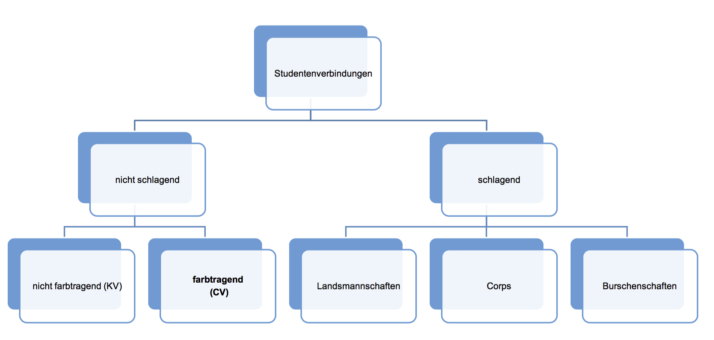

# Fragestellung

--------

> Welche Rolle spielt soziales Kapital beim Beitritt, in der aktiven Phase und in der Zeit ab dem Abschluss des Studiums für Mitglieder von Verbindungen in Graz, die im ÖCV organisiert sind?

# Feld
## Hochschulverbindungslandschaft in Österreich

Eigene Darstellung.

<i>Quelle:</i> Hartmann, Gerhard. 2001. Der CV in Österreich. Seine Entstehung. Seine Geschichte. Seine Bedeutung. 3. Aufl. Limburg-Kevelaer: Lahn Verlag

## ÖCV

- Österreichischer Cartellverband
- 48 Verbindungen
- rund 12.500 Mitgliedern

<i>Quelle:</i> Homepage des ÖCV. Abrufbar unter: https://www.oecv.at/ [31.10.2015]

## Prinzipien

- Farbtragend
- Antiduellität
- *Katholizität*
- *Wissenschaftlichkeit*
- *Lebensfreundschaft*
- *Vaterlandsliebe*

<i>Quelle:</i> Hartmann, Gerhard. 2001. Der CV in Österreich. Seine Entstehung. Seine Geschichte. Seine Bedeutung. 3. Aufl. Limburg-Kevelaer: Lahn Verlag

# Theorie
## Kapital
Bourdieu unterteilt den Begriff des Kapitals in:

-   ökonomisches Kapital
-   kulturelles Kapital
-   soziales Kapital

<i>Quelle:</i> Pierre Bourdieu: <i>Ökonomisches Kapital, kulturelles Kapital, soziales Kapital</i> In: Reinhard Kreckel (Hg.): <i>Soziale Ungleichheiten (Soziale Welt Sonderband 2)</i>, Göttingen 1983, S. 183-198

## Kulturelles Kapital

-   inkorporiertes Kapital
-   objektiviertes Kapital
-   institutionalisiertes Kapital

<i>Quelle:</i> Pierre Bourdieu: <i>Ökonomisches Kapital, kulturelles Kapital, soziales Kapital</i> In: Reinhard Kreckel (Hg.): <i>Soziale Ungleichheiten (Soziale Welt Sonderband 2)</i>, Göttingen 1983, S. 183-198

## Soziales Kapital
-   setzt sich aus einem Netz sozialer Beziehungen zusammen
-   eine Gruppe basiert auf Homogenität der Gruppenmitglieder (gegenseitige Anerkennung)
-   Mithilfe der Gruppe kann soziales Kapital reproduziert werden und daraus unter anderem ökonomischer Nutzen erzielt werden

<i>Quelle:</i> Pierre Bourdieu: <i>Ökonomisches Kapital, kulturelles Kapital, soziales Kapital</i> In: Reinhard Kreckel (Hg.): <i>Soziale Ungleichheiten (Soziale Welt Sonderband 2)</i>, Göttingen 1983, S. 183-198

## Konzeption des Habitus
> „Wahrnehmungs-, Denk- und Handlungsschemata“ (Bourdieu 1987 [1980]: 101) eines Menschen, in denen sämtliche inkorporierte frühere soziale Erfahrungen zum Ausdruck kommen.

<i>Quelle:</i> (Lenger; Schneickert; Schumacher 2013: 14)

## Theorie der Praxis

>[(Habitus) (Kapital)] + Feld = Praxis

<i>Quelle:</i> (Bourdieu 1982 [1979]: 175)

# Methodik
## Beobachtung

- Offen
- Teilnehmend
- Deskriptive Beobachtung
- Fokussierte Beobachtung
- Dokumentation:
    + Feldtagebuch

## Qualitative Interviews 1

- explorativ
- vier narrativ-biographische Interviews
- Falldarstellungen

## Qualitative Interviews 2

- Halbstandardisierte oder Leitfadeninterviews
- Vorgehen nach *Grounded Theory*
- Sampling:
    + 8-12 Interviews
    + Theoretical Sampling
- Auswertung:
    + Codieren

# Zeitplan
## Wintersemester

Novmeber

Dezember

Jänner

<i>4.11.</i> Vorstellung des Designs

<i>25.11.</i> Endversion qualitatives Design

Erstellung des Leitfadens

Auswertung der Interviews

<i>28.11.</i> 1. Beobachtung

Explorative Interviews

<i>18.12.</i> 2. Beobachtung

Teilstrukturierte Interviews

## Sommersemester

März

April

Mai

Trennung der Gruppe in quali. und quanti.

Erstellung des Fragebogens

Fortsetzung: Auswertung Interviews

Auswertung quantitative Erhebung

Fortsetzung: Qualitative Interviews

Quantitative Erhebung

# Offenes
## Fragen ans Plenum

- Frage 1
- Frage 2
- Frage 3

<!-- To change keyboard bindings for remote presentation tool:
keyboard: {
    39: 'next',
    37: 'prev'
}
 -->
